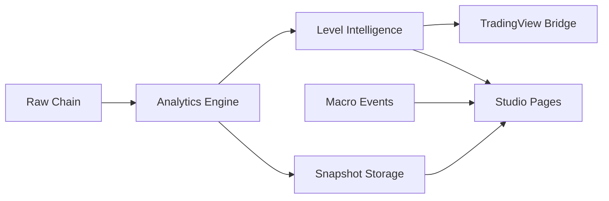

# GexLab v2

<div align="center">

<svg width="100%" height="220" viewBox="0 0 1200 220" fill="none" xmlns="http://www.w3.org/2000/svg" role="img" aria-label="GexLab v2 banner">
  <defs>
    <linearGradient id="bg" x1="0" y1="0" x2="1200" y2="220" gradientUnits="userSpaceOnUse">
      <stop stop-color="#0F1115"/>
      <stop offset="0.45" stop-color="#171B22"/>
      <stop offset="1" stop-color="#241D12"/>
    </linearGradient>
    <linearGradient id="gold" x1="180" y1="40" x2="1010" y2="180" gradientUnits="userSpaceOnUse">
      <stop stop-color="#F5D27A"/>
      <stop offset="0.45" stop-color="#D4AF37"/>
      <stop offset="1" stop-color="#8D7331"/>
    </linearGradient>
    <radialGradient id="glow" cx="0" cy="0" r="1" gradientUnits="userSpaceOnUse" gradientTransform="translate(780 98) rotate(146.614) scale(358.294 143.933)">
      <stop stop-color="#D4AF37" stop-opacity="0.28"/>
      <stop offset="1" stop-color="#D4AF37" stop-opacity="0"/>
    </radialGradient>
  </defs>

  <rect width="1200" height="220" rx="28" fill="url(#bg)"/>
  <rect x="24" y="24" width="1152" height="172" rx="22" stroke="url(#gold)" stroke-opacity="0.34"/>
  <ellipse cx="820" cy="112" rx="310" ry="96" fill="url(#glow)"/>

  <path d="M110 160C180 116 262 102 337 108C415 114 473 144 553 146C631 149 693 127 754 108C830 84 901 74 1007 86" stroke="url(#gold)" stroke-width="3.5" stroke-linecap="round"/>
  <path d="M112 132C178 95 238 84 311 90C384 97 458 126 528 129C618 133 689 100 762 82C833 64 923 57 1088 86" stroke="#F5E7BF" stroke-opacity="0.28" stroke-width="2" stroke-linecap="round" stroke-dasharray="8 8"/>

  <circle cx="222" cy="108" r="4" fill="#F5D27A"/>
  <circle cx="528" cy="129" r="4" fill="#D4AF37"/>
  <circle cx="759" cy="82" r="4" fill="#F5D27A"/>
  <circle cx="1008" cy="86" r="4" fill="#D4AF37"/>

  <text x="92" y="84" fill="#F6F1E7" font-family="Georgia, serif" font-size="18" letter-spacing="6">OPTIONS INTELLIGENCE STUDIO</text>
  <text x="92" y="128" fill="#FFFFFF" font-family="Arial, Helvetica, sans-serif" font-size="54" font-weight="700">GEXLAB V2</text>
  <text x="94" y="160" fill="#D9CBB3" font-family="Arial, Helvetica, sans-serif" font-size="20">
    Dealer gamma, volatility structure, expiry pressure, replay, and TradingView bridge workflows.
  </text>
</svg>

<br />


<p><strong>A multi-page options analytics studio for SPY and QQQ.</strong></p>
<p>GexLab v2 blends live chain ingestion, dealer-greek analytics, relevant level extraction, futures conversion, saved end-of-day replay, macro event context, and a TradingView payload bridge into one routed dashboard.</p>

</div>

---

## Why This Exists

Most retail-facing options dashboards either:

- stop at raw chain data,
- flatten everything into one noisy screen,
- or hide the actual structural map behind generic charts.

GexLab v2 is built around a different idea:

- show dealer positioning clearly,
- separate workflows into focused pages,
- keep replay and live mode in the same product,
- make important levels portable into TradingView,
- and preserve a high-signal studio feel instead of a spreadsheet feel.

---

## Signal Stack

<table>
  <tr>
    <td width="33%">
      <svg width="100%" viewBox="0 0 320 170" xmlns="http://www.w3.org/2000/svg">
        <rect width="320" height="170" rx="20" fill="#12161C"/>
        <rect x="16" y="16" width="288" height="138" rx="14" fill="#191F27" stroke="#D4AF37" stroke-opacity="0.35"/>
        <text x="28" y="42" fill="#D8C7A1" font-family="Arial" font-size="12" font-weight="700" letter-spacing="2">FLOW ENGINE</text>
        <text x="28" y="72" fill="white" font-family="Arial" font-size="24" font-weight="700">Chain Ingestion</text>
        <text x="28" y="100" fill="#B7AB9A" font-family="Arial" font-size="13">Yahoo chain pulls</text>
        <text x="28" y="120" fill="#B7AB9A" font-family="Arial" font-size="13">Basis lookup</text>
        <text x="28" y="140" fill="#B7AB9A" font-family="Arial" font-size="13">Snapshot storage</text>
      </svg>
    </td>
    <td width="33%">
      <svg width="100%" viewBox="0 0 320 170" xmlns="http://www.w3.org/2000/svg">
        <rect width="320" height="170" rx="20" fill="#12161C"/>
        <rect x="16" y="16" width="288" height="138" rx="14" fill="#191F27" stroke="#D4AF37" stroke-opacity="0.35"/>
        <text x="28" y="42" fill="#D8C7A1" font-family="Arial" font-size="12" font-weight="700" letter-spacing="2">QUANT LAYER</text>
        <text x="28" y="72" fill="white" font-family="Arial" font-size="24" font-weight="700">Dealer Analytics</text>
        <text x="28" y="100" fill="#B7AB9A" font-family="Arial" font-size="13">GEX / DEX / VEX / CHEX</text>
        <text x="28" y="120" fill="#B7AB9A" font-family="Arial" font-size="13">Gamma flip / walls / max pain</text>
        <text x="28" y="140" fill="#B7AB9A" font-family="Arial" font-size="13">Per-expiry structural levels</text>
      </svg>
    </td>
    <td width="33%">
      <svg width="100%" viewBox="0 0 320 170" xmlns="http://www.w3.org/2000/svg">
        <rect width="320" height="170" rx="20" fill="#12161C"/>
        <rect x="16" y="16" width="288" height="138" rx="14" fill="#191F27" stroke="#D4AF37" stroke-opacity="0.35"/>
        <text x="28" y="42" fill="#D8C7A1" font-family="Arial" font-size="12" font-weight="700" letter-spacing="2">STUDIO LAYER</text>
        <text x="28" y="72" fill="white" font-family="Arial" font-size="24" font-weight="700">Routed Dashboard</text>
        <text x="28" y="100" fill="#B7AB9A" font-family="Arial" font-size="13">Replay + live views</text>
        <text x="28" y="120" fill="#B7AB9A" font-family="Arial" font-size="13">Theme + futures mode</text>
        <text x="28" y="140" fill="#B7AB9A" font-family="Arial" font-size="13">TradingView bridge</text>
      </svg>
    </td>
  </tr>
</table>

---

## What You Can Do

### Core analytics

- Track `net GEX`, `DEX`, `vega`, `charm`, and strike-level pressure.
- Surface `gamma flip`, `call wall`, `put wall`, `session ceiling`, `session floor`, `max pain`, `vanna magnet`, and more.
- Inspect `OI walls`, weak OI pockets, protected gamma ranges, aggressive flow levels, and skew-rich / skew-cheap strikes.
- Filter relevant levels by `DTE` for near-expiry structure up to 5 days.

### Live + replay workflow

- Poll live SPY / QQQ data during active sessions.
- Save EOD-style snapshots to local storage under `data/snapshots/...`.
- Jump to historical dates and replay the same analytics stack off saved files.
- Fall back to saved data overnight instead of leaving the UI empty.

### Usability layer

- Switch between `ETF native` and `futures converted` pricing.
- Use dark / light mode across the full studio.
- Move through dedicated pages instead of one overloaded dashboard.
- Reorder sidebar navigation by dragging and dropping items.
- Keep per-page scroll position when switching routes.

### External workflow bridge

- Export a compressed TradingView payload.
- Use the bundled Pine indicator scaffold in [`gexlab_v2_indicator.txt`](./gexlab_v2_indicator.txt).
- Carry richer relevant levels into TV instead of only a minimal wall set.

---

## Studio Map

| Page | Purpose | Best For |
|---|---|---|
| `Overview` | Regime, key levels, ladder, near-term pressure, quick summary | Fast daily read |
| `Levels` | Grouped market landmarks by theme | Mapping the tape |
| `Exposure` | Gamma concentration, heat, ladder, strike inspection | Dealer pressure zones |
| `Volatility` | IV surface and skew structure | Vol terrain |
| `Chain` | Expiry mix, term structure, ratio panels | Positioning by expiry |
| `Vega` | Vol sensitivity by strike | Vol risk clustering |
| `Charm` | Time-decay flow pressure | Intraday decay read |
| `Events` | Macro calendar and structural markers | Decision context |
| `Ledger` | Contract-by-contract raw inspection | Deep audit |

---

## Visual Architecture

```text
                         GEXLAB V2
        ┌──────────────────────────────────────────────┐
        │            Next.js Studio Frontend           │
        │  overview • levels • exposure • replay • TV │
        └──────────────────────┬───────────────────────┘
                               │
                     /api/metrics/*  /api/history/*
                               │
        ┌──────────────────────▼───────────────────────┐
        │              FastAPI Quant Backend           │
        │ ingestion • basis • analytics • levels       │
        └───────────────┬───────────────┬──────────────┘
                        │               │
                Yahoo / basis     Macro event sources
                        │               │
                        ▼               ▼
                local snapshots     cached event feed
```

---

## Feature Deep Dive

<details>
<summary><strong>Relevant Levels Engine</strong></summary>

The levels layer is not just a few headline strikes. It currently supports:

- aggregated call / put walls
- top wall clusters
- gamma flip
- max pain
- session ceiling / floor
- OI call / put walls
- weak OI call / put levels
- protected gamma highs / lows
- aggressive call ceiling / put floor
- skew rich / skew cheap strikes
- per-DTE variants of the above

</details>

<details>
<summary><strong>Replay + User Data</strong></summary>

Snapshots are written locally so historical mode does not depend on the upstream chain source supporting good history.

That also means users can add their own files manually:

```text
data/
  snapshots/
    SPY/
      2026-04-10.json
    QQQ/
      2026-04-10.json
```

If a snapshot follows the saved payload shape, it becomes selectable in the UI automatically.

</details>

<details>
<summary><strong>Macro Event Layer</strong></summary>

The app favors official or near-official macro context over generic market-news clutter.

Current event sources include:

- `BLS` event timing
- `Federal Reserve` FOMC calendar parsing
- structural options markers like `0DTE`, `1DTE`, and `monthly OPEX`
- optional local custom events

</details>

<details>
<summary><strong>TradingView Bridge</strong></summary>

The backend can compress the latest level set into a compact payload for TradingView workflows.

That bridge can include:

- gamma flip
- call / put walls
- max pain
- vanna magnet
- richer derived structural levels

</details>

---

## Quick Start

### 1. Backend

```bash
cd backend
venv\Scripts\python -m pip install -r requirements.txt
venv\Scripts\python -m uvicorn main:app --reload
```

### 2. Frontend

```bash
cd frontend
npm install
npm run dev
```

### 3. Open the studio

```text
Frontend: http://localhost:3000
Backend:  http://127.0.0.1:8000
```

### 4. One-command local launch

```bash
run.bat
```

---

## API Surface

### Health + core data

- `GET /`
- `GET /api/health`
- `GET /api/metrics/raw`
- `GET /api/metrics/analytics/{ticker}`
- `GET /api/metrics/bridge/{ticker}`

### Replay + snapshots

- `GET /api/history/{ticker}/dates`
- `GET /api/history/{ticker}/{snapshot_date}`

### Macro context

- `GET /api/events/macro`

---

## Local Data Layout

```text
backend/
  services/
    analytics/
    macro_events.py
    storage.py
  tests/
  main.py
  models.py

frontend/
  src/
    app/
    components/
    hooks/
    lib/
    types/

data/
  snapshots/
    SPY/
    QQQ/
```

---

## Stack

### Frontend

- `Next.js 16`
- `React 19`
- `TypeScript`
- `Tailwind CSS v4`
- `framer-motion`
- `next-themes`
- `Recharts`
- `Plotly`

### Backend

- `FastAPI`
- `uvicorn`
- `yfinance`
- `pandas`
- `numpy`
- `scipy`
- `httpx`

---

## Design Notes

The UI direction for this repo is intentionally not “generic dashboard SaaS.”

It is designed to feel:

- editorial
- premium
- high-signal
- restrained in motion
- readable under heavy information density

That design guidance is also captured in [`.impeccable.md`](./.impeccable.md).

---

## Repo Highlights

<div align="center">



</div>

---

## Current Strengths

- focused routed experience instead of one bloated page
- local replay and user-added snapshots
- official-source macro context direction
- strong relevant-level extraction
- futures conversion workflow
- TradingView handoff path

---

## Practical Limitations

- live options chain data currently relies on `yfinance`, which is practical but not a licensed direct-feed solution
- macro events are cleaner than market-news integration, by design
- local snapshot quality depends on the chain data available when saved

---

## Suggested Next Steps

- add README screenshots / GIFs once the UI settles
- add a sample snapshot JSON template for user imports
- add a `reset sidebar order` control in-app
- add tests around more derived level families
- add a production deployment guide

---

## TradingView Note

Use the bundled indicator scaffold here:

- [`gexlab_v2_indicator.txt`](./gexlab_v2_indicator.txt)

Typical workflow:

1. Open the dashboard.
2. Copy the bridge payload.
3. Paste it into the indicator inputs.
4. Toggle the level families you want visible in TV.

---

## License / Use

This repo is currently structured like a private project workspace. If you plan to open-source it, the next step is to add an explicit license and a cleaned-up contribution section.

---

<div align="center">

<svg width="100%" height="90" viewBox="0 0 1200 90" fill="none" xmlns="http://www.w3.org/2000/svg" role="img" aria-label="README footer accent">
  <rect width="1200" height="90" rx="18" fill="#11151B"/>
  <path d="M60 58C152 32 244 25 336 39C420 52 491 64 570 58C657 52 722 28 812 24C910 20 1000 37 1140 60" stroke="#D4AF37" stroke-width="3" stroke-linecap="round"/>
  <text x="600" y="53" text-anchor="middle" fill="#F4EEE3" font-family="Georgia, serif" font-size="18" letter-spacing="4">GEXLAB V2 • LIVE STRUCTURE • REPLAY • BRIDGE</text>
</svg>

</div>
