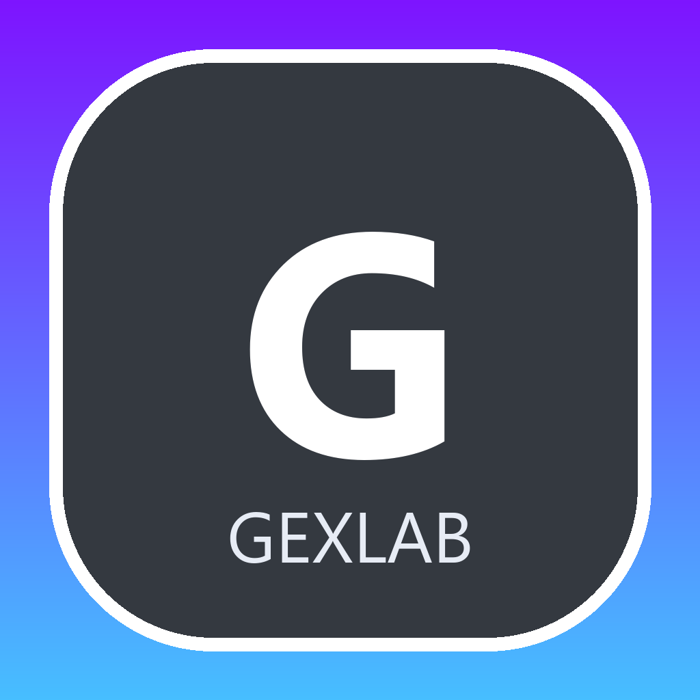

# GEXLAB

<p align="center">
  
</p>

<p align="center">
  <svg width="100%" viewBox="0 0 1200 280" fill="none" xmlns="http://www.w3.org/2000/svg" role="img" aria-label="GEXLAB hero banner">
    <rect width="1200" height="280" rx="28" fill="#0D1117"/>
    <rect x="24" y="24" width="1152" height="232" rx="20" fill="url(#bg)"/>
    <path d="M68 196C142 196 142 96 216 96C290 96 290 196 364 196C438 196 438 96 512 96C586 96 586 196 660 196C734 196 734 96 808 96C882 96 882 196 956 196C1030 196 1030 96 1104 96" stroke="url(#line)" stroke-width="8" stroke-linecap="round"/>
    <circle cx="216" cy="96" r="10" fill="#7E14FF"/>
    <circle cx="660" cy="196" r="10" fill="#47BFFF"/>
    <circle cx="1104" cy="96" r="10" fill="#7E14FF"/>
    <rect x="90" y="72" width="310" height="54" rx="27" fill="#101722" stroke="#202b3a"/>
    <text x="245" y="106" text-anchor="middle" fill="#DCE7F7" font-family="Segoe UI, Arial, sans-serif" font-size="24" font-weight="700">GEXLAB</text>
    <text x="90" y="164" fill="#F8FBFF" font-family="Segoe UI, Arial, sans-serif" font-size="54" font-weight="800">Gamma Exposure</text>
    <text x="90" y="214" fill="#B9C5D6" font-family="Segoe UI, Arial, sans-serif" font-size="26" font-weight="500">Web dashboard + native desktop app for local, more reliable use</text>
    <rect x="864" y="58" width="222" height="54" rx="14" fill="#111927" stroke="#2B3950"/>
    <text x="975" y="91" text-anchor="middle" fill="#9FD8FF" font-family="Segoe UI, Arial, sans-serif" font-size="22" font-weight="700">Local App Preferred</text>
    <rect x="864" y="130" width="222" height="54" rx="14" fill="#111927" stroke="#2B3950"/>
    <text x="975" y="163" text-anchor="middle" fill="#E8EFFF" font-family="Segoe UI, Arial, sans-serif" font-size="22" font-weight="700">Website Can Rate-Limit</text>
    <defs>
      <linearGradient id="bg" x1="24" y1="24" x2="1176" y2="256" gradientUnits="userSpaceOnUse">
        <stop stop-color="#141B29"/>
        <stop offset="0.45" stop-color="#131724"/>
        <stop offset="1" stop-color="#0F1721"/>
      </linearGradient>
      <linearGradient id="line" x1="68" y1="140" x2="1104" y2="140" gradientUnits="userSpaceOnUse">
        <stop stop-color="#7E14FF"/>
        <stop offset="1" stop-color="#47BFFF"/>
      </linearGradient>
    </defs>
  </svg>
</p>

<p align="center">
  
  
  
  
</p>

<p align="center">
  Free gamma exposure analytics for retail traders, with a native desktop app for local use.
</p>

## Why This Exists

GEXLAB makes dealer positioning visible without requiring a paid terminal.

It includes:

- GEX profile by strike
- GEX heatmap by expiration
- key levels such as call wall, put wall, zero gamma, max pain, and vol trigger
- DEX, vanna, IV skew, put/call ratio, OI distribution, unusual flow, and topology views
- futures translation for mappings like `SPY -> /ES` and `QQQ -> /NQ`
- a native desktop app that bundles the frontend and backend into an installable local application

## Recommended Usage

> [!IMPORTANT]
> The website can get rate-limited often during heavier usage because requests stack through shared web infrastructure and the upstream data source.
> If you want the stable version, use the local desktop app.

Why the local app is better:

- fewer rate-limit collisions from shared web traffic
- the backend runs on your machine instead of through a shared hosted layer
- no browser-tab localhost workflow for end users
- generally better reliability during market hours

## Visual Preview

<p align="center">
  
</p>

## Feature Grid

<table>
  <tr>
    <td width="33%">
      <h3>Gamma Structure</h3>
      <p>Map dealer gamma exposure by strike, identify walls, and track regime shifts around zero gamma.</p>
    </td>
    <td width="33%">
      <h3>Term Structure</h3>
      <p>Use the heatmap and expiration views to see where near-dated positioning is concentrated.</p>
    </td>
    <td width="33%">
      <h3>Local Desktop App</h3>
      <p>Install a native app window that starts the bundled backend locally for a more reliable experience.</p>
    </td>
  </tr>
  <tr>
    <td width="33%">
      <h3>Key Levels</h3>
      <p>Call wall, put wall, zero gamma, vol trigger, and max pain are computed directly from the chain.</p>
    </td>
    <td width="33%">
      <h3>Dealer Flow Signals</h3>
      <p>Inspect DEX, vanna, IV skew, put/call ratio, unusual flow, and OI concentration in one place.</p>
    </td>
    <td width="33%">
      <h3>Futures Translation</h3>
      <p>Translate ETF levels to futures equivalents so the levels are usable on actual futures charts.</p>
    </td>
  </tr>
</table>

## Web Vs Local App

```text
Website:
browser -> hosted frontend -> hosted backend -> market data source

Desktop app:
native app window -> local bundled backend -> market data source
```

The desktop route removes the shared hosted bottleneck, which is the part most likely to get hit when traffic spikes.

## Stack

- Frontend: React, TypeScript, Vite, ECharts
- Backend: FastAPI, Python
- Desktop: Electron, PyInstaller, electron-builder
- Data: Yahoo Finance-backed options data processed by the backend

## Desktop App

Windows installer output:

- `desktop-dist/GEXLAB-Setup-1.0.0.exe`

Run from source:

```bat
npm run desktop:build:frontend
run_desktop_app.bat
```

Build the installer:

```bat
npm install
backend\venv\Scripts\python.exe -m pip install -r backend\requirements.txt
backend\venv\Scripts\python.exe -m pip install pyinstaller
npm run desktop:build
```

Cross-platform packaging is configured in `package.json` for:

- Windows: `nsis`
- macOS: `dmg`, `zip`
- Linux: `AppImage`, `deb`

## Web Development

Backend:

```bat
run_backend.bat
```

Frontend:

```bat
run_frontend.bat
```

Then open:

```text
http://localhost:3000
```

## Formula

```text
GEX = Gamma x Open Interest x 100 x Spot^2 x 0.01 / 1,000,000,000
```

Interpretation:

- output is in billions of dollars per 1% move
- positive net gamma tends to dampen volatility
- negative net gamma tends to amplify volatility

## Project Layout

```text
backend/                FastAPI app and GEX engine
frontend/               React dashboard
desktop/                Electron shell and desktop assets
desktop-build/          Intermediate desktop build artifacts
desktop-dist/           Installers and packaged app output
run_backend.bat         Local backend runner
run_frontend.bat        Local frontend runner
run_desktop_app.bat     Local desktop app runner
```

## Notes

- The desktop app is the preferred user distribution because the website is more likely to get rate-limited.
- The desktop app still uses loopback internally for its bundled backend, but users interact with a normal app window, not a browser-based localhost setup.
- Build artifacts are ignored by `.gitignore`.

## Disclaimer

This project is for informational and educational use. It is not financial advice. Options trading is high risk.
